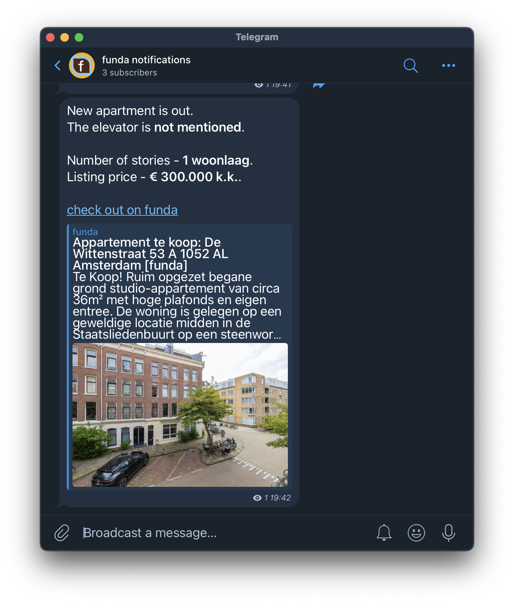

# Funda notification bot


## Setting up
1. Create telegram bot following [official documentation](https://core.telegram.org/bots/tutorial).
1. Create a channel, invite your bot into the channel
1. [find out the channel id](https://stackoverflow.com/a/50984134)
1. Create an sqlite database with a single table:
    ```
    sqlite3 funda.py
    create table listing(street text);
    ```
1. Install dependencies with:
    ```
    pip install -r requirements.txt
    ```
1. Define environment variables:
    ```
    export FUNDA_DB=... # location of sqlite database
    export TELEGRAM_TOKEN=... # telegram token 1234567890:QWERTYQWERTYQWERTYQWERTYQWERTYQWERT
    export CHAT_ID=... # -1234567890
    export SEARCH_URL=... # funda search url https://www.funda.nl/zoeken/...
    ```
1. Run the app to get notifications for new listings:
    ```
    python3 scraper.py
    ```
1. Configure a cron job to run on certain intervals
1. Enjoy and don't miss any new listings!